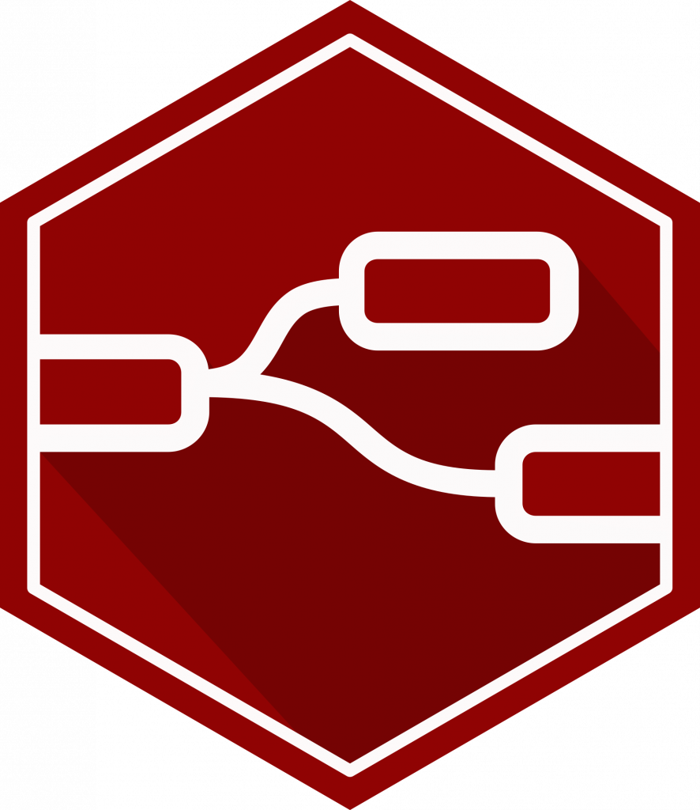
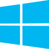

<h1 align="center">⚙️ Cibersecurity researcher in operational technology ⚡</h1>

<!-- avatar alinhado à direita -->

---

<!-- Linha de ícones (use imagens em assets/ ou links públicos) -->

  &nbsp;
  &nbsp;
  &nbsp;
  &nbsp;
  &nbsp;
  &nbsp;

---

<!-- botões sociais usando shields.io -->

  
  
  

 

<!-- "coffee for visitors" - você pode usar uma imagem custom -->

  

---

<!-- o grid (SVG) que vamos gerar localmente -->

---

<!-- barra verde longa - exemplo -->

  

